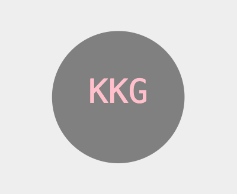

# week-10-module-challenge

# Object-oriented Programming Challenge: SVG Logo Maker

## User Story
AS a freelance web developer  
I WANT to generate a simple logo for my projects  
SO THAT I don't have to pay a graphic designer  

## Acceptence Criteria
GIVEN a command-line application that accepts user input  
WHEN I am prompted for text  
THEN I can enter up to three characters  
WHEN I am prompted for the text color  
THEN I can enter a color keyword (OR a hexadecimal number)  
WHEN I am prompted for a shape  
THEN I am presented with a list of shapes to choose from: circle, triangle, and square  
WHEN I am prompted for the shape's color  
THEN I can enter a color keyword (OR a hexadecimal number)  
WHEN I have entered input for all the prompts  
THEN an SVG file is created named `logo.svg`  
AND the output text "Generated logo.svg" is printed in the command line  
WHEN I open the `logo.svg` file in a browser  
THEN I am shown a 300x200 pixel image that matches the criteria I entered  

### Resources
*The following links were used as reference to create my portfolio page*

- https://www.w3schools.com/graphics/svg_examples.asp
- https://jestjs.io/docs/getting-started
- https://en.wikipedia.org/wiki/SVG
- https://developer.mozilla.org/en-US/docs/Web/SVG/Tutorial/Basic_Shapes
- https://developer.mozilla.org/en-US/docs/Web/SVG/Tutorial/Texts

Link to walkthrough video: https://drive.google.com/file/d/1p64ymHWhAyOZWTh3M-B22R_V4_x-uKCu/view

